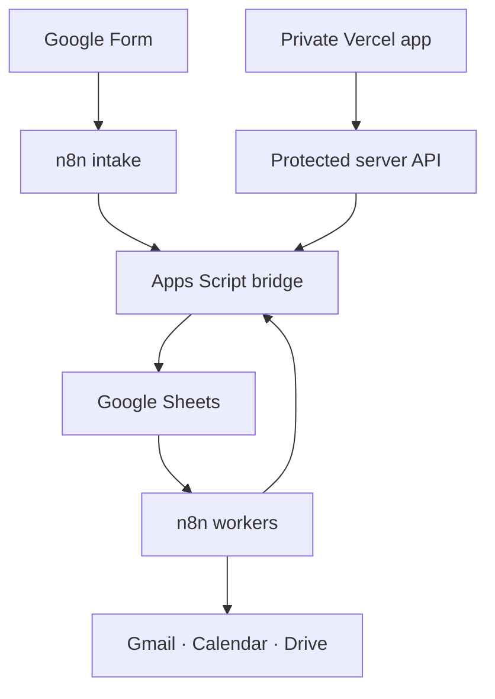

# Solar EPC Operations Command Center · V2

Private Solar EPC CRM and operations application built by Arjun Choudhary. It manages the operational journey from enquiry capture through follow-ups, site visits, proposals, delivery tracking, acceptance, and conversion.

## Current status

- Private production deployment on Vercel
- Access protected by Vercel Authentication for all deployments
- Live business data stored in Google Sheets through an Apps Script bridge
- External work executed by six inactive-by-default n8n workflows
- Gmail, Google Calendar, Drive/Docs, and PDF proposal delivery tested end to end
- 32 automated checks passing
- Desktop, tablet, and 390 × 844 mobile layouts verified
- AI qualification optional and disabled by default

## Business capabilities

| Area | Capability |
|---|---|
| Enquiries | Capture, validate, deduplicate, assign, qualify, update, stop, and convert leads |
| Follow-ups | Create manual or email tasks, track outcomes, prevent duplicates, and stop pending work |
| Site visits | Schedule, reschedule, complete, and cancel visits with stable Calendar events |
| Proposals | Create versioned proposals, generate private Docs/PDFs, share reviewed versions, and record decisions |
| Delivery | Queue work, claim once, record provider outcomes, and isolate uncertain sends for review |
| Management | Display operational counts and queue a daily summary email |

## Architecture



The browser never receives the Apps Script token. It calls `/api/workspace`; the Vercel function adds server-only credentials and forwards approved actions to Apps Script. The API rejects cross-origin writes, large requests, unsupported actions, invalid integration URLs, and incomplete configuration.

## Safety baseline

Keep these workbook settings during controlled testing:

```text
SEND_MODE=TEST
AUTOMATION_ENABLED=No
```

Keep n8n schedules inactive until each workflow is deliberately enabled. Never commit configured n8n exports, Apps Script deployment URLs, tokens, Vercel environment files, Google credentials, or real client exports.

## Server environment variables

Configure these in Vercel for Preview and Production. Values are stored in Vercel, not in Git:

```text
SOLAR_APPS_SCRIPT_URL=
SOLAR_AUTOMATION_TOKEN=
SOLAR_OPERATOR_EMAIL=
```

The first two should be Secret values. The operator email may be Config. Do not prefix any of them with `NEXT_PUBLIC_`.

## Verification

The current baseline passed:

- Vercel-targeted Nitro/Vinext production build
- 32 automated business-rule, API, workflow-topology, UI-component, and bundle checks
- Google Sheets read and write through the protected Vercel Preview
- Enquiry intake and duplicate protection
- Follow-up queueing and test email delivery
- Calendar create, reschedule, and cancel
- Proposal document/PDF generation and attached email delivery
- Proposal acceptance, enquiry conversion, and pending-task cleanup
- Manager-summary queueing and email delivery
- Responsive checks at laptop, tablet, and mobile widths

See [VALIDATION.md](VALIDATION.md) for the verification record and [CONNECTING.md](CONNECTING.md) for private deployment and integration guidance.

## Local verification on Windows

Use Node.js 24 and install the locked dependencies:

```powershell
npm.cmd install --legacy-peer-deps

$env:NITRO_PRESET = "vercel"
npx.cmd vite build
$solarBuildCode = $LASTEXITCODE
Remove-Item Env:\NITRO_PRESET -ErrorAction SilentlyContinue

$solarTestFiles = Get-ChildItem .\tests -File -Filter "*.test.mjs" |
  Select-Object -ExpandProperty FullName
node --test $solarTestFiles
```

A local `.env*` file may be used for development, but it is ignored and must never be committed.
