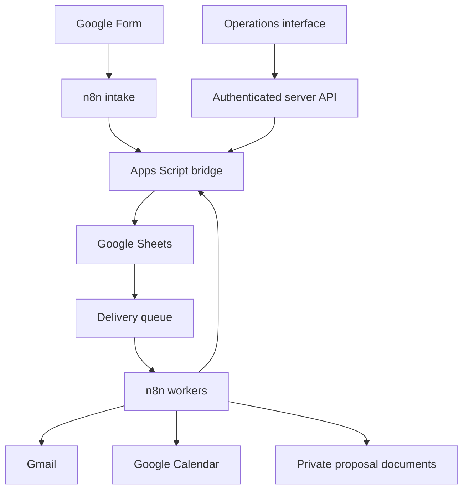

# Solar EPC Operations · V2

Private portfolio prototype by Arjun Choudhary. An operations interface backed by Google Sheets, Apps Script and n8n. AI qualification is optional and off by default.

Start with [CONNECTING.md](CONNECTING.md). Downloadable imports are in `integrations/n8n/`; copy both `.gs` files and the manifest from `integrations/apps-script/` into your Apps Script project.



The bridge applies shared business rules and records state changes, queue items, and activity together. Workers claim one task and confirm its provider result. The interface defaults to a durable private sample workspace until the Sheets connection is configured.

## Local development

This checkout uses the Sites/Vinext starter and its Cloudflare-compatible server. Keep the supplied Sites plugin, authentication boundary and binding configuration when deploying on Sites. Vercel requires a separate runtime/auth adapter as described in CONNECTING.md.

```sh
npm run install:ci
node scripts/build-integrations.mjs
node --test tests/solar-core.test.mjs tests/workspace-api.test.mjs
npm run build
```

The Google services and n8n instance are not contacted by these tests. See [VALIDATION.md](VALIDATION.md) for verification limits and [SHEET_CHANGES.md](SHEET_CHANGES.md) for the applied workbook additions.
